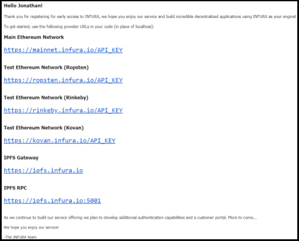

title: Using Infura
---

To deploy to a test network  (or even the mainnet), you usually have [to synchronize a blockchain node yourself](/docs/blockchain_configuration.html#Testnet-configuration) to be able to connect.

There is thankfully another alternative to save time and it is to use something like [Infura](https://infura.io/), that has already synchronized nodes to which you can connect to.

They offer nodes for the most popular testnets like Ropsten, Kovan and Rinkeby and also for the main network.

### Registration

To start you will need to first register with Infura. Go to [https://infura.io/register](https://infura.io/register) and register.

Afterwards, you will get an API KEY by email. Save this key, you will need it to configure Infura. Careful, it is private.

### Account Configuration

To deploy to Infura, we need to configure Embark with an account containing funds.

In this example we will use a mnemonic.
It is also possible to use a private key (the documentation for the accounts functionality can be found [here](https://embark.status.im/docs/contracts.html#Using-accounts-in-a-wallet)).

Make sure to read our recommendations on how to make sure your credentials stay secure [here](http://localhost:4000/docs/contracts_deployment.html#Deploying-to-Mainnet).

Edit your contract configuration (usually found at `config/contracts.js`) and add a new environment, which we will name `infura`:

<pre>
<button class="btn" data-clipboard-target="#code-1"></button>
<code class="javascript"><mark id="code-1" class="highlight-inline">infura: {
  deployment:{
    accounts: [
      {
        mnemonic: process.env.yourMnemonic
      }
    ]
  }
}
</mark></code></pre>

Make sure the account has funds in the network you are deploying to. Most testnets have faucets.
For example you can find a faucet for Rinkeby [here](https://faucet.rinkeby.io/).

### Adding Infura

Now we will add the infura endpoint to our configuration. **You should replace the key in the `host` field with your own.**
We will use Rinkeby for this example. You can specify the network as `<network>.infura.io`.

<pre>
<button class="btn" data-clipboard-target="#code-2"></button>
<code class="javascript">infura: {
  deployment:{
    accounts: [
      {
        mnemonic: process.env.yourMnemonic
      }
    ]<mark id="code-2" class="highlight-inline">,
    host: "rinkeby.infura.io/YOUR_KEY",
    port: false,
    protocol: 'https'
    type: "rpc"</mark>
  }
}
</code></pre>

### Deploying

Now to deploy, all you need to do is run `embark run infura` and Embark will deploy using Infura!

