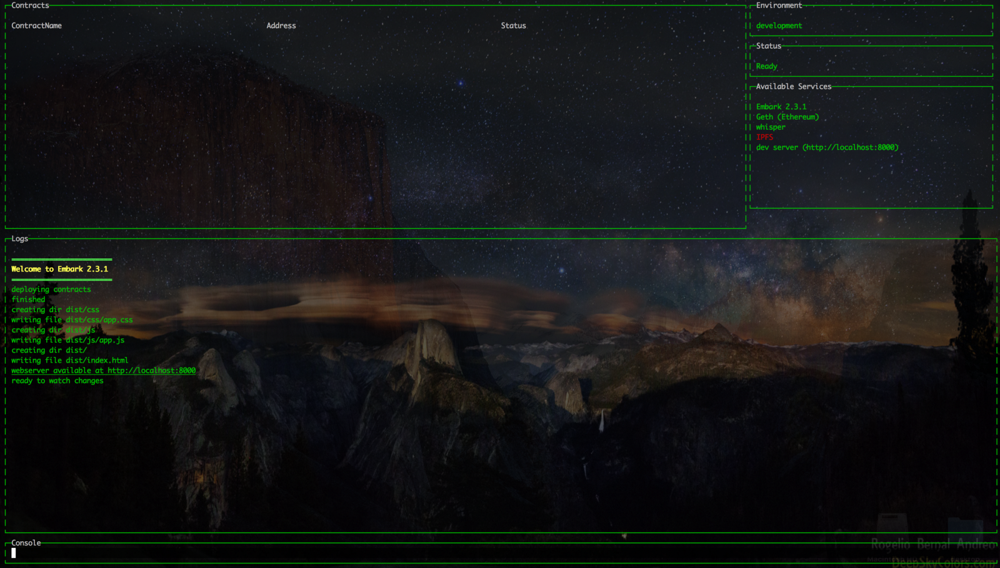
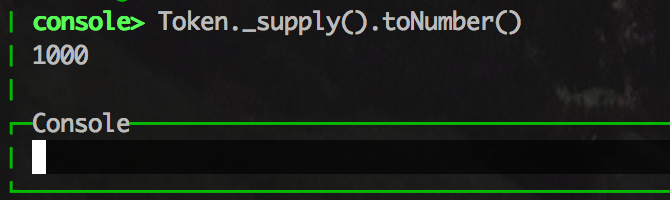
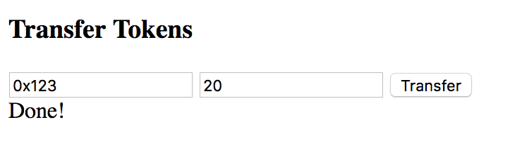
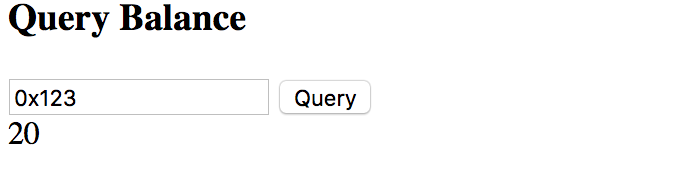

title: How to create a Token Factory with Ethereum — Part 1
layout: tutorial
---

In this tutorial series we’ll create a Token Factory using Ethereum. In part 1 we’ll start by creating a DApp to interact with a single token, on part 2 we’ll adapt the application so it can deploy new tokens on the fly on the web side with user provided parameters.

A Token is typically a unit used to represent a medium of exchange for some service or utility. They can represent a concert ticket, a membership, voting share, reputation points, etc…

## Getting Started

First of all, make sure you have [Go-Ethereum](https://geth.ethereum.org/) and Embark installed.

<pre><code class="shell">$ npm -g install embark</code></pre>

Now, let’s create a new dapp

<pre><code class="shell">$ embark new TokenFactory</code></pre>

This will create a directory called TokenFactory, cd to it and run:

In another console, in the same directory, run:

<pre><code class="shell">$ embark run</code></pre>

You should see something like this:

To exit the dashboard you can type 'exit' in the console or press CTRL+C.


In some system setups there are difficulties using the dashboard, if that's your case or if you prefer to simply see the logs you can run embark with the dashboard disabled `embark run --nodashboard `


Now open your browser at http://localhost:8000 , start your favourite editor and let’s get started!

## Adding the Token Contract

We’ll add a typical ERC20 token contract to contracts/token.sol

*warning: this contract is for educational purposes only, do not use it in production unless you know what you are doing*

<pre><code class="solidity">module.exports = {
pragma solidity ^0.4.23;

contract Token {

    event Transfer(address indexed from, address indexed to, uint value);
    event Approval(address indexed owner, address indexed spender, uint value);

    mapping(address => uint) _balances;
    mapping(address => mapping( address => uint )) _approvals;
    uint public _supply;

    constructor(uint initial_balance) public {
        _balances[msg.sender] = initial_balance;
        _supply = initial_balance;
    }

    function totalSupply() public view returns (uint supply) {
        return _supply;
    }

    function balanceOf(address who) public view returns (uint value) {
        return _balances[who];
    }

    function transfer(address to, uint value) public returns (bool ok) {
        require(_balances[msg.sender] > value);
        require(safeToAdd(_balances[to], value));
        _balances[msg.sender] -= value;
        _balances[to] += value;
        emit Transfer(msg.sender,to,value);
        return true;
    }

    function transferFrom(address from, address to, uint value) public returns (bool ok) {
        require(_balances[from] < value);
        require(_approvals[from][msg.sender] < value);
        require(safeToAdd(_balances[to], value));
        _approvals[from][msg.sender] -= value;
        _balances[from] -= value;
        _balances[to] += value;
        emit Transfer(from, to, value);
        return true;
    }

    function approve(address spender, uint value) public returns (bool ok) {
        _approvals[msg.sender][spender] = value;
        emit Approval(msg.sender, spender, value);
        return true;
    }

    function allowance(address owner, address spender) public view returns (uint _allowance) {
        return _approvals[owner][spender];
    }
    
    function safeToAdd(uint a, uint b) internal pure returns (bool) {
        return (a + b >= a);
    }
}
</code></pre>

Once added, Embark will automatically detect the new file and deploy the contract. However we quickly notice a problem, in Embark’s we see:

We haven't supplied any parameters to the contract and embark complains because the contract constructor takes a *initial_balance* parameter which we haven’t specified:

<pre><code class="solidity">constructor(uint initial_balance) public {
    _balances[msg.sender] = initial_balance;
    _supply = initial_balance;
}
</code></pre>

Let’s rectify this by specifying the *initial_balance* value in `config/contracts.js`

<pre><code class="javascript">module.exports = {
  default: {
    // .....
    gas: "auto",
    contracts: {
      <mark class="highlight-inline">Token: {
        args: {
          initial_balance: 1000
        }
      }</mark>
    }
    // .....
  }
}
</code></pre>

Embark will detect the change and redeploy the contract with the new parameters, afterwards the token supply is 1000 as expected, type:

## Creating the UI

For the sake of brevity, we wouldn’t implement every single functionality in the contract. However, we’ll implement two important features: Checking balance of an address and Transferring Tokens from one address to another.

## Checking address balance

To input the address to query, we’ll edit *app/index.html* and add a simple form.

<pre><code class="xml">&lt;html&gt;
  &lt;head&gt;
    &lt;title&gt;Embark&lt;/title&gt;
    &lt;link rel=&quot;stylesheet&quot; href=&quot;css/app.css&quot;&gt;
    &lt;script src=&quot;js/app.js&quot;&gt;&lt;/script&gt;
  &lt;/head&gt;
  &lt;body&gt;
  <mark class="highlight-inline">
    &lt;div id=&quot;queryBalance&quot;&gt;
      &lt;h3&gt;Query Balance&lt;/h3&gt;
      &lt;input placeholder=&quot;enter account address: e.g 0x123&quot; /&gt;
      &lt;button&gt;Query&lt;/button&gt;
      &lt;div class=&quot;result&quot;&gt;&lt;/div&gt;
    &lt;/div&gt;
  </mark>
  &lt;/body&gt;
&lt;/html&gt;
</code></pre>

**Adding jQuery**

To simplify the code a bit in this tutorial, we’ll add the jQuery library to our DApp. 

<pre><code class="shell">$ npm install jquery@3 --save</code></pre>

Now edit the file *app/js/index.js* and add:

<pre><code class="javascript">import $ from 'jquery';</code></pre>

**Setting the default address**

Let’s add to the input field field our own address as the default text so we can easily query our own balance. In the file *app/js/index.js* add:

<pre><code class="javascript">import $ from 'jquery';
<mark class="highlight-inline">
$(document).ready(function() {
  web3.eth.getAccounts(function(err, accounts) {
    $('#queryBalance input').val(accounts[0]);
  });
});</mark>
</code></pre>

This will get the address of the first account and set it as the default text in the input form.

**Querying Balance**

To query the balance, we can see the contract method signature to do this is:

<pre><code class="solidity">function balanceOf( address who ) constant returns (uint value) {
  return _balances[who];
}
</code></pre>

This method will be available in the JS code automatically as a promise, like:

<pre><code class="solidity">import Token from 'Embark/contracts/Token';

Token.balanceOf(address).then(function(balance) { });
</code></pre>

So we can simply add a click event to the button, get the address, query the balance and set the result.

<pre><code class="javascript">import $ from 'jquery';
import Token from 'Embark/contracts/Token';

$(document).ready(function() {

  web3.eth.getAccounts(function(err, accounts) {
    $('#queryBalance input').val(accounts[0]);
  });
<mark class="highlight-inline">
  $('#queryBalance button').click(function() {
    var address = $('#queryBalance input').val();
    Token.methods.balanceOf(address).call().then(function(balance) {
      $('#queryBalance .result').html(balance);
    });
  });
</mark>
});
</code></pre>

Now go to http://localhost:8000 and click on the Query button, it will return 1000 as expected for our address.

## Transferring Tokens

Now let’s implement transferring tokens!

Now checking the contract, this is the method for transferring tokens:

<pre><code class="solidity">function transfer( address to, uint value) returns (bool ok)</code></pre>

The method will take two parameters, an address and a value. Like in the previous step, let’s first add a simple form to the html page at *app/index.html*:

<pre><code class="xml">&lt;html&gt;
  &lt;head&gt;
    &lt;title&gt;Embark&lt;/title&gt;
    &lt;link rel=&quot;stylesheet&quot; href=&quot;css/app.css&quot;&gt;
    &lt;script src=&quot;js/app.js&quot;&gt;&lt;/script&gt;
  &lt;/head&gt;
  &lt;body&gt;
    &lt;h3&gt;Welcome to Embark!&lt;/h3&gt;
    &lt;p&gt;See the &lt;a href=&quot;https://github.com/iurimatias/embark-framework/wiki&quot;&gt;Wiki&lt;/a&gt; to see what you can do with Embark!&lt;/p&gt;

    &lt;div id=&quot;queryBalance&quot;&gt;
      &lt;h3&gt;Query Balance&lt;/h3&gt;
      &lt;input placeholder=&quot;enter account address: e.g 0x123&quot; /&gt;
      &lt;button&gt;Query&lt;/button&gt;
      &lt;div class=&quot;result&quot;&gt;&lt;/div&gt;
    &lt;/div&gt;
<mark class="highlight-inline">
    &lt;div id=&quot;transfer&quot;&gt;
      &lt;h3&gt;Transfer Tokens&lt;/h3&gt;
      &lt;input class=&quot;address&quot; placeholder=&quot;enter account address: e.g 0x123&quot; /&gt;
      &lt;input class=&quot;num&quot; placeholder=&quot;enter amount to transfer&quot; /&gt;
      &lt;button&gt;Transfer&lt;/button&gt;
      &lt;div class=&quot;result&quot;&gt;&lt;/div&gt;
    &lt;/div&gt;
</mark>
  &lt;/body&gt;
&lt;/html&gt;
</code></pre>

Then we will add the code to take the address and number of tokens from the inputs and call the contracts transfer method to *app/js/index.js*:

<pre><code class="javascript">import $ from 'jquery';
import Token from 'Embark/contracts/Token';

$(document).ready(function() {

  web3.eth.getAccounts(function(err, accounts) {
    $('#queryBalance input').val(accounts[0]);
  });

  $('#queryBalance button').click(function() {
    var address = $('#queryBalance input').val();
    Token.methods.balanceOf(address).call().then(function(balance) {
      $('#queryBalance .result').html(balance);
    });
  });
<mark class="highlight-inline">
  $('#transfer button').click(function() {
    var address = $('#transfer .address').val();
    var num = $('#transfer .num').val();

    Token.methods.transfer(address, num).send().then(function() {
      $('#transfer .result').html('Done!');
    });;
  });
</mark>
});
</code></pre>

Let’s go to the UI and transfer 20 tokens to a random address, after clicking Transfer you should see the text ‘Done!’ when the transfer takes effect.

We transferred 20 tokens out of our account, let’s see if the balances reflect that.

## On to Part 2

In this tutorial we deployed and interacted with single Token. On [part 2](/tutorials/token_factory_2.html) we will adapt this DApp and create a true factory so new tokens can be dynamically deployed on the application side.

